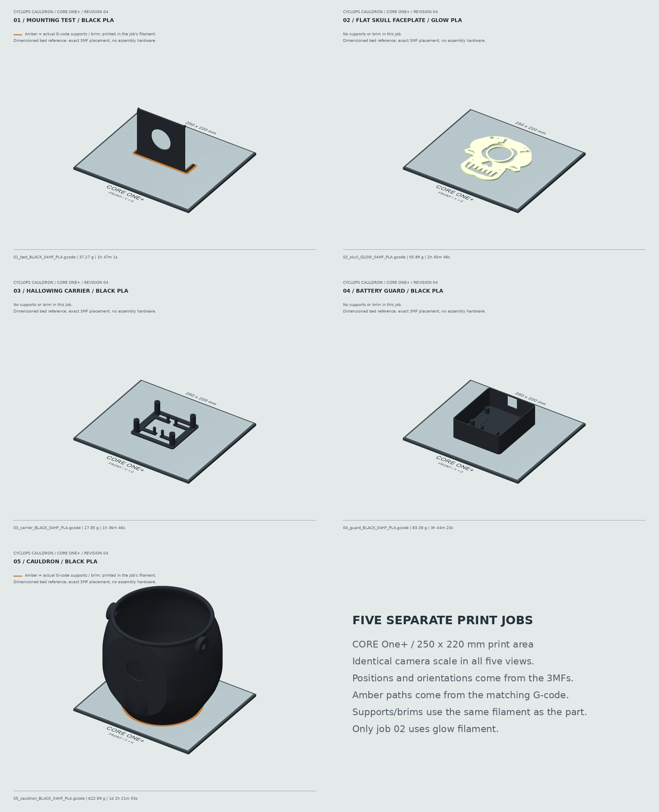
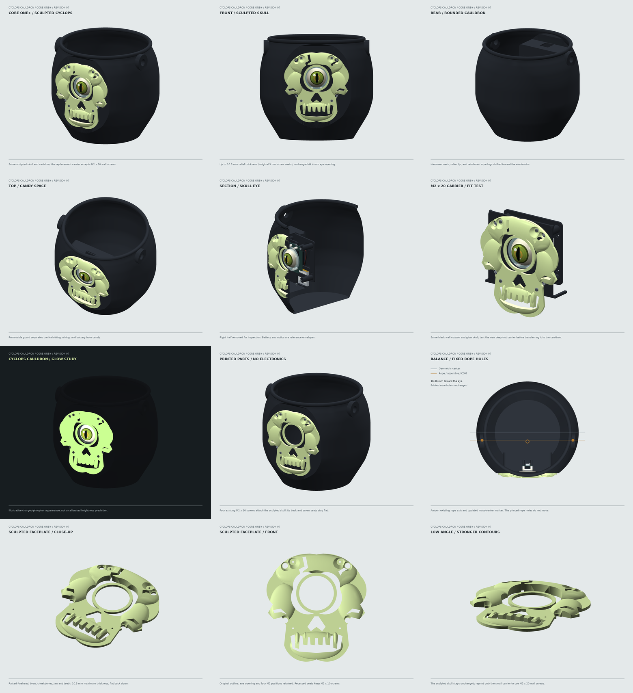

# Cyclops Cauldron For CORE One+

A single-nozzle black cauldron with a **separately printed glow skull**, attached
using four M2 screws. The HalloWing M0, glass lens, battery cradle, and removable
candy guard remain serviceable. Revision 4 fits the CORE One+ and retains the
electronics-compensated rope holes. **Physical fit and hanging tests are still required.**

## Optional Sculpted Faceplate

The `feature/sculpted-skull-faceplate` branch adds a
[shallow 3D replacement skull](variants/sculpted_skull/README.md) for an already
printed cauldron and HalloWing carrier. It preserves the flat back, hole pattern,
eye bezel and **3 mm screw seats**, while raising the forehead, cheeks and jaw
to **6.2 mm maximum thickness**. The existing M2 x 10 hardware still fits.

Review the [before/after comparison](variants/sculpted_skull/renders/comparison.png)
or [assembled preview](variants/sculpted_skull/renders/05_assembled.png).
The [replacement-only G-code](variants/sculpted_skull/skull_sculpted_COREONE_04HF_PLA.gcode)
uses the same conditional **0.4 mm hardened high-flow / glow PLA** setup below,
with 0.10 mm layers: approximately **71.8 g and 4 h 4 m**.
**No cauldron or carrier reprint is needed.** The original files and instructions
below are unchanged; the new design is optional and has not been physically tested.

## USB Files: Check The Setup First

Five actual, audited G-code jobs are included. **They are not universal printer
files.** Hardware and filament details were unavailable, so these explicit
assumptions were used:

- Stock **Prusa CORE One+**, single tool, with firmware compatible with Prusa's
  current official COREONE profile. The files carry the **6.8.1+16182** firmware notice.
- **0.4 mm high-flow nozzle**, wear-resistant/hardened for the glow print.
- **1.75 mm PLA and glow PLA**, both rated for **220 C first layer, 215 C thereafter**.
- **Clean smooth PEI sheet, 60 C bed**; official chamber control is retained.

**Do not run these files with a 0.6 mm or standard-flow nozzle, PETG, an MMU/INDX
profile, or incompatible filament.** Prusament PETG Ultraglow is PETG, not PLA.
Do not bypass printer/nozzle warnings. When the setup matches, follow the
[USB checklist](usb/COREONE_04HF_PLA/START_HERE.txt) and
[printing instructions](docs/PRINTING.md).

| USB Job | Filament | Estimate | Time |
| --- | --- | ---: | ---: |
| [01 Mounting test](usb/COREONE_04HF_PLA/01_test_BLACK_04HF_PLA.gcode) | Black PLA | 37.27 g | 1 h 47 m |
| [02 Skull faceplate](usb/COREONE_04HF_PLA/02_skull_GLOW_04HF_PLA.gcode) | Glow PLA | 55.89 g | 2 h 46 m |
| [03 HalloWing carrier](usb/COREONE_04HF_PLA/03_carrier_BLACK_04HF_PLA.gcode) | Black PLA | 27.85 g | 1 h 37 m |
| [04 Battery guard](usb/COREONE_04HF_PLA/04_guard_BLACK_04HF_PLA.gcode) | Black PLA | 83.38 g | 3 h 44 m |
| [05 Full cauldron](usb/COREONE_04HF_PLA/05_cauldron_BLACK_04HF_PLA.gcode) | Black PLA | 622.99 g | 26 h 22 m |

Print jobs **01-04 and perform the fit test before job 05**. Reuse the skull,
carrier, and guard in the full cauldron. Change filament between jobs through
the printer menu; there are no mid-print color changes and no purge tower.


## Design

- Printed body envelope: **224 x 209 x 200 mm**, with a rounded belly, narrowed
  neck, **8 mm rolled lip**, and a stable 146 mm flat base. No printed handle.
- **3 mm nominal walls, 3.6 mm floor**, and 10 mm thick rope anchors.
- Two **13 mm rope holes**, intended for approximately 8-10 mm nylon sail rope.
- Both holes are **16.66 mm forward of the geometric center**, toward the eye,
  compensating for the complete electronics assembly and glow decoration.
- A **128 x 138 x 3 mm glow skull**, printed flat and surface-mounted with
  **four M2 x 10 screws, washers, and nuts**. The black wall is not recessed.
- **44.4 mm through-hole** for the stock 40 mm glass lens. The acrylic kit,
  not the printed bezel, retains the glass.
- Removable carrier, 12 mm PCB rear-component clearance, and +/-2 mm vertical
  eye alignment. Four **M2 screws attach the carrier to the bucket**.
- A removable candy guard with a **33 x 42 x 8.5 mm battery bay**, strap slots,
  wire space, ventilation slots, and top USB access.

**Hardware correction:** Adafruit's #4013 lens kit uses **M2.5**, not M2.
This design keeps its 6 mm M2.5 lens standoffs and uses separate M2 bucket
fasteners. Four longer M2.5 screws are needed behind the PCB. Do not screw M2
fasteners into the kit's M2.5 threads. See the [hardware list](docs/ASSEMBLY.md).

## Editable Print Files

| File | Contents |
| --- | --- |
| [Mounting test 3MF](print/01_mount_test_black.3mf) | Black 116 x 28 x 103 mm wall section |
| [Skull faceplate 3MF](print/02_skull_faceplate_glow.3mf) | Flat glow print, reused after the test |
| [Carrier 3MF](print/03_carrier_black.3mf) | Black, back-down with posts pointing up |
| [Battery guard 3MF](print/04_guard_black.3mf) | Black, back-down with walls pointing up |
| [Cauldron 3MF](print/05_cauldron_black.3mf) | Black, upright on its base |
| [Assembled STEP](cad/assembled_bucket.step) | Editable solids in assembly coordinates, without electronics |
| [Parametric source](design/bucket.py) | Cauldron profile, skull, mass balance, mounting details, and test section |

Each 3MF contains **one material, on extruder 1**, correctly positioned on a
250 x 220 mm bed. STL and STEP parts are included too. These geometry files can
be resliced for a different nozzle or material with the matching official
printer preset. The flat faceplate STL is now independently printable; do not
combine black and glow as a multipart co-print. Old dual-head plates are retired.

Assembly details and the screw list are in the
[fit-test guide](docs/ASSEMBLY.md#fit-test-first).

## Filament Budget

All figures include one full bucket, one test section, one carrier, and one guard.

| Material | Solid CAD upper estimate | Printing allowance | Budget | Offline sliced estimate |
| --- | ---: | ---: | ---: | ---: |
| Black | 782.59 g | 125 g | **907.59 g** | **771.49 g** |
| Glow | 55.71 g | 50 g | **105.71 g** | **55.89 g** |

Assumed maximum densities: **1.30 g/cm3 black, 2.00 g/cm3 glow**. The offline
slice includes supports, brims, and the official single-nozzle startup purge.
Estimates are not measurements of a physical print. Extra copies, failed prints,
and manual filament-loading purges are not included. Both supplied job totals
are below **1,000 g per spool**, with substantial remaining margin.

## Balanced Rope Mounts

The left/right hole centers are **X = +/-99.33, Y = -16.66, Z = 178 mm**.
Their axis passes through the calculated fore-aft center of mass of the empty,
fully assembled cauldron, with the center of mass about 78 mm below that axis.
The nominal model includes the printed body, skull, carrier, guard, PCB,
battery, glass, acrylic kit, screws, washers, strap, and pad. It excludes the
test coupon, removed supports, and a symmetric rope handle.

| Centered candy load | Predicted fore-aft tilt |
| --- | ---: |
| Empty, electronics installed | Approximately 0 degrees |
| 500 g | 3.9 degrees |
| 1,000 g | 5.3 degrees |

Leaving the holes on the geometric centerline would produce about **12.0 degrees**
of empty tilt in this model. Actual hardware masses, infill, and uneven candy
change the result; this is not a guarantee of perfect balance at every load.
See the [balance diagram](renders/10_rope_balance.png) and
[hanging-test instructions](docs/ASSEMBLY.md#rope-balance).

## Print Bed Previews

These show **five separate jobs**, each in its actual 3MF position and print
orientation on a dimensioned **250 x 220 mm CORE One+ bed reference**. All views
use the same camera scale. Amber lines are brim/support extrusion paths from
the matching USB G-code; they print in the job's filament, not a second colour.
No electronics, screws, or assembled-part transforms are added to these views.
The bed is a dimensional reference, not a detailed model of the printer chassis.

| Job | Print Bed Render |
| --- | --- |
| 01 Black mounting test | [View](renders/print_beds/01_mount_test_black.png) |
| 02 Glow skull faceplate, flat | [View](renders/print_beds/02_skull_faceplate_glow.png) |
| 03 Black HalloWing carrier, posts up | [View](renders/print_beds/03_carrier_black.png) |
| 04 Black battery guard, open side up | [View](renders/print_beds/04_guard_black.png) |
| 05 Black cauldron, upright | [View](renders/print_beds/05_cauldron_black.png) |



## Review The Design

[Nine-view overview](renders/overview.png) includes front, rear, top, cutaway,
test mounting, a glow study, the empty printed eye opening, and rope balance.
An additional [exploded assembly view](renders/07_exploded_mount.png) is included.
All printed parts are rendered from the exported STL meshes. The eye animation,
electronic components, and glass optics are illustrative reference geometry;
they are not printable parts or a prediction of optical focus/glow brightness.



## Rebuild

Python 3.11 was used on ARM Linux. CadQuery creates the solids; VTK/PyVista
renders offscreen. No OpenSCAD or Blender installation is needed.

```sh
uv venv .venv --python 3.11
uv pip install --python .venv/bin/python -r requirements.txt
.venv/bin/python tools/build.py
.venv/bin/python tools/render.py
.venv/bin/python tools/check_slicer.py --slicer /path/to/prusa-slicer-2.9.6
.venv/bin/python tools/render.py --print-beds
```

The `check_slicer.py` command requires **PrusaSlicer 2.9.6** and regenerates the official-derived
profiles and USB G-code, publishing only after all five jobs pass the audit.
On this ARM Linux/WSL machine it uses the official portable Windows build via
interop; `--slicer` accepts a native 2.9.6 executable on another platform.
The first run downloads the pinned profile bundle if it is not cached.
Profile sources and assumptions are recorded in [profiles/provenance.json](profiles/provenance.json).
The build checks
solid validity, closed/wound meshes, material and assembly collisions, matching
coupon geometry, fastener clearances, bed bounds, and filament budgets.
It also checks support-critical body slopes, material centroids, and the
computed rope axis against the actual reinforced mounting bores.
The G-code audit checks executable startup and shutdown commands, single-nozzle
use, temperature limits, flow limits, and all model-phase moves. It is not a
physical print test or confirmation of the user's unspecified machine setup.
The `--print-beds` render command checks the 3MF and G-code hashes against that
audit before drawing the five job previews. It does not regenerate or modify
the print files. Use `--print-beds --jobs 2 5` to refresh selected views only.

Results: [CAD/mesh validation](docs/validation.json),
[native slicer validation](docs/slicer_validation.json), and
[mechanical sources and assumptions](docs/SOURCES.md).