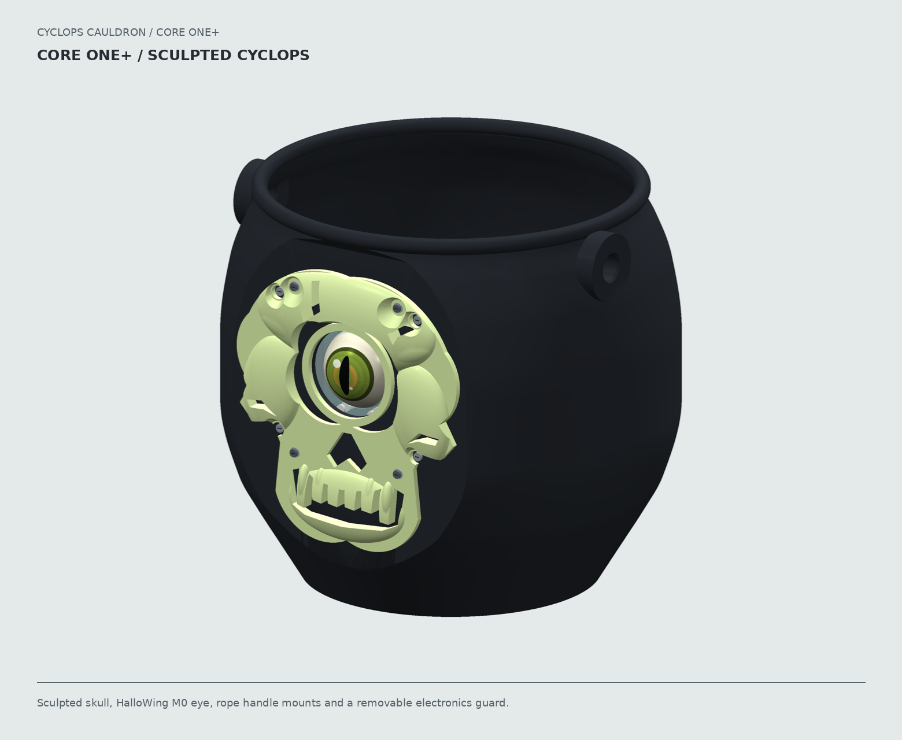
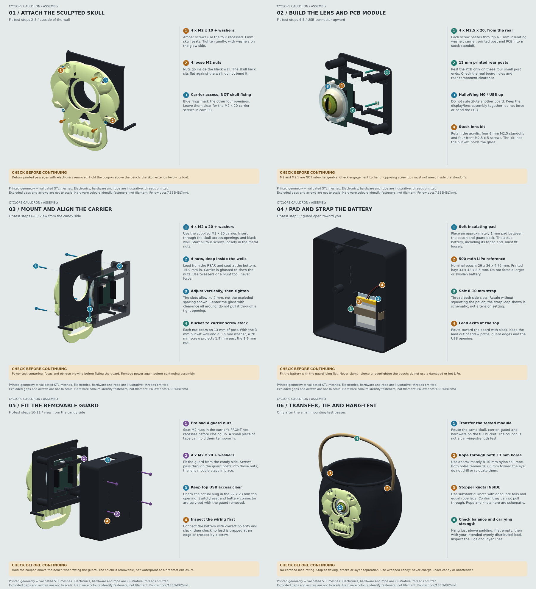

# Cyclops Cauldron

A 3D-printed Halloween candy bucket with a sculpted skull, an animated
HalloWing eye behind a glass lens, and a rope handle. The skull prints
separately in white or glow PLA; the electronics sit behind a removable
battery cradle and candy guard.

The project includes parametric CAD, STEP and STL exports, editable print
plates, assembly illustrations, and audited G-code for a **Prusa CORE One+**.
All parts can be printed with a single nozzle and assembled with screws.



**Build status:** the printed design has been reported to assemble and work
successfully. CAD and slicing checks also pass. Each builder should still
check their hardware fit and carrying strength; there is no certified load
rating or impact-resistance claim.

## Start Here

1. **Gather the hardware.** Use a HalloWing **M0**, its lens kit, and the
   fasteners in the [hardware list](docs/ASSEMBLY.md#hardware-list).
2. **Check your printer setup.** The supplied G-code requires the
   [CORE One+ configuration below](#printer-and-materials). For another setup,
   reslice the geometry with the appropriate printer and filament profiles.
3. **Print the small parts first.** Print the mounting test, one skull, and
   one carrier plus guard. The carrier and guard can share a plate.
4. **Fit-test the electronics.** Follow the
   [illustrated assembly guide](docs/ASSEMBLY.md#illustrated-assembly-sequence)
   and [fit-test procedure](docs/ASSEMBLY.md#fit-test-first).
5. **Print the cauldron and finish the build.** Transfer the tested parts,
   attach the rope, and complete the [hanging checks](docs/ASSEMBLY.md#rope-balance).

The mounting test is a small section of the bucket wall. It lets you check
the screws, lens alignment, PCB clearance and guard before the full bucket
print. The skull, carrier, guard and electronics used in the test are reused
in the finished bucket.

## What You Need

- Conventional PLA for the body, carrier, guard and mounting test; white PLA
  or suitable glow-in-the-dark PLA for the skull.
- Adafruit **HalloWing M0 #3900**, **40 mm glass lens #3853**, and
  **acrylic lens-holder kit #4013**.
- Adafruit **3.7 V, 500 mAh LiPo #1578**, a soft insulating pad and a
  hook-and-loop battery strap.
- **Eight M2 x 20**, **four M2 x 10**, and **four M2.5 x 20** machine screws,
  **12 M2 nuts**, **12 M2 washers**, and **four M2.5 insulating washers**.
  Keep the kit's four front M2.5 x 5 screws.
- Approximately **8-10 mm nylon sail rope** for the handle.

See the [complete bill of materials](docs/ASSEMBLY.md#hardware-list) for
washer dimensions, nut sizes and the purpose of each fastener. **M2 and M2.5
are different threads:** the bucket mounts use M2; the lens kit uses M2.5.

The eye runs on the HalloWing. This repository supplies the mechanical build,
not custom firmware; use the [electronics setup instructions](docs/ASSEMBLY.md#prepare-the-eye-electronics)
to check the eye demo before installing the board.

## Printer And Materials

Use the supplied G-code only when your setup matches:

| Requirement | Supplied configuration |
| --- | --- |
| Printer | Prusa CORE One+, single tool, without MMU or INDX |
| Nozzle | **0.4 mm high-flow**; wear-resistant/hardened for glow PLA |
| Filament | **1.75 mm PLA**, suitable for 220 C first layer / 215 C thereafter |
| Sheet / bed | Clean smooth PEI suitable for PLA, **60 C** |
| Firmware | Compatible with the official COREONE profile; jobs include notice **6.8.1+16182** |

Do not bypass printer or nozzle warnings. Standard-flow or different-diameter
nozzles, other printers, and other materials require reslicing. **Glow PETG is
not glow PLA** and must not use these files. Ordinary white PLA does not
require the glow job's abrasive-material setting.

Read the [printing guide](docs/PRINTING.md) and
[USB checklist](usb/COREONE_04HF_PLA/START_HERE.txt) before starting.

## Choose Your Print Jobs

For one complete build, choose **one skull material** and **one way to print
the carrier and guard**. Do not print both alternatives unless you want spares.

| Part or plate | G-code | Filament estimate | Time estimate |
| --- | --- | ---: | ---: |
| Mounting test | [01 Test](usb/COREONE_04HF_PLA/01_test_BLACK_04HF_PLA.gcode) | 37.27 g PLA | 1 h 47 m |
| Skull: white option | [02 White skull](usb/COREONE_04HF_PLA/02_skull_WHITE_04HF_PLA.gcode) | 64.17 g PLA | 4 h 52 m |
| Skull: glow option | [02 Glow skull](usb/COREONE_04HF_PLA/02_skull_GLOW_04HF_PLA.gcode) | 98.72 g glow PLA | 5 h 40 m |
| Carrier and guard together | [03+04 Combined](usb/COREONE_04HF_PLA/03_04_carrier_guard_BLACK_04HF_PLA.gcode) | 109.53 g PLA | 5 h 17 m |
| Carrier only | [03 Carrier](usb/COREONE_04HF_PLA/03_carrier_BLACK_04HF_PLA.gcode) | 26.20 g PLA | 1 h 32 m |
| Guard only | [04 Guard](usb/COREONE_04HF_PLA/04_guard_BLACK_04HF_PLA.gcode) | 83.38 g PLA | 3 h 44 m |
| Full bucket, after fit testing | [05 Cauldron](usb/COREONE_04HF_PLA/05_cauldron_BLACK_04HF_PLA.gcode) | 622.99 g PLA | 26 h 22 m |

The combined plate prints both parts **layer-by-layer**, not one complete
object at a time. It contains exactly the same carrier and guard as the
individual jobs. All jobs use one filament on extruder 1, with no purge tower
or mid-print colour changes.

With the combined plate, budget approximately **769.79 g for the body,
mounting test, carrier and guard**, plus **64.17 g white** or **98.72 g glow**
for the skull. Separate carrier/guard jobs bring the first total to 769.84 g.
These are slicer estimates including automatic startup purge, not measured
print weights. Leave extra filament for loading, retries and spares.

## Assembly



The [assembly guide](docs/ASSEMBLY.md) covers mounting the skull, assembling
the lens/PCB module, aligning the carrier, securing the battery, fitting the
guard and attaching the rope.

- The skull attaches with **four M2 x 10 screws** and outside washers.
- The carrier attaches with **four M2 x 20 screws**. Seat its nuts at the
  bottoms of the **15.9 mm deep rear rectangular wells**, not at the openings.
- The PCB/lens module uses **four M2.5 x 20 screws with 1 mm insulating washers**.
  The stock acrylic kit retains the glass; the printed bezel does not clamp it.
- The guard attaches with the other **four M2 x 20 screws** and can be removed
  for battery and electronics access.

Use wrapped candy or a suitable liner. Check rope knots and printed anchors
over a padded surface before carrying a load. Protect the glass from impacts,
keep the electronics dry, and charge the LiPo under supervision with the
bucket empty and the guard removed. See [safe use and servicing](docs/ASSEMBLY.md#final-assembly-and-use).

## Design At A Glance

| Feature | Dimension |
| --- | --- |
| Printed body envelope | **224 x 209 x 200 mm** |
| Walls / floor | **3 mm nominal / 3.6 mm** |
| Rim / rope anchors | **8 mm rolled lip / 10 mm thick anchors** |
| Rope holes | **13 mm**, positioned toward the electronics |
| Sculpted skull | Approximately **128 x 138 mm**, up to **10.5 mm** thick |
| Skull screw seats / eye opening | **3 mm / 44.4 mm** |
| PCB rear-component clearance | **12 mm**, with **+/-2 mm** vertical eye adjustment |
| Battery bay | **33 x 42 x 8.5 mm** |

Explore the [design overview](renders/overview.png),
[exploded assembly](renders/07_exploded_mount.png),
[skull details](renders/faceplate_overview.png) and
[individual print-bed previews](renders/print_beds/overview.png).
Renders use the exported print meshes. Electronics, fasteners and optics are
illustrative; the green skull and glow study are not brightness predictions
or representations of white PLA.

## Editable Files And Project Layout

| Location | Contents |
| --- | --- |
| [print/](print/) | STL parts and placed geometry 3MFs, including the [combined carrier/guard plate](print/03_04_carrier_guard_black.3mf) |
| [cad/](cad/) | Individual STEP solids and the [assembled bucket](cad/assembled_bucket.step) |
| [design/](design/) | Parametric [bucket and mounting design](design/bucket.py) and [sculpted faceplate](design/sculpted_faceplate.py) |
| [usb/COREONE_04HF_PLA/](usb/COREONE_04HF_PLA/) | Ready-to-print jobs for the documented printer setup |
| [profiles/](profiles/) | Slicer settings and pinned profile provenance |
| [docs/](docs/) | Printing, assembly, mechanical sources and validation reports |
| [renders/](renders/) | Design views, assembly cards and print-bed illustrations |
| [tools/](tools/) and [tests/](tests/) | Export, slicing, rendering and validation tooling |

The skull geometry files use the name `bucket_glow` or
`02_skull_faceplate_glow.3mf`; **the same shape is used for white and glow PLA**.
Material selection belongs to the slicer profile. The geometry 3MFs can be
resliced for other supported setups; do not treat the supplied G-code as
printer-independent.

## Rebuild

You do not need the development tools to print the supplied jobs. For CAD,
slicer and render work, use Python 3.11 with the pinned
[dependencies](requirements.txt), CadQuery, PyVista/VTK and **PrusaSlicer 2.9.6**.
The rendering scripts use Linux DejaVu fonts. From the repository root on
Linux or WSL:

```sh
uv venv .venv --python 3.11
uv pip install --python .venv/bin/python -r requirements.txt
.venv/bin/python tools/build.py
.venv/bin/python tools/check_slicer.py --slicer /path/to/prusa-slicer-2.9.6
.venv/bin/python tools/check_slicer.py --white-skull --slicer /path/to/prusa-slicer-2.9.6
.venv/bin/python tools/check_slicer.py --carrier-guard --slicer /path/to/prusa-slicer-2.9.6
.venv/bin/python tools/render.py
.venv/bin/python tools/render_assembly.py
.venv/bin/python tools/render.py --print-beds
.venv/bin/python -m unittest discover -s tests
```

The build exports the carrier and assembled STEP, checks all parts, and
preserves the supplied body, skull, guard and coupon exports against
[pinned hashes](docs/printed_parts.json). The default slicer command
regenerates the individual carrier job and audits all five individual jobs;
the two flags generate the white skull and combined plate separately.
Render commands do not modify manufacturing files.

Each generated job is checked for native import, model bounds, tool
assignment, temperatures, flow, startup and shutdown. CAD checks cover solid
and mesh validity, mounting passages, collisions, clearances and material
budgets. These checks complement physical fitting; they do not certify
carrying strength, optical performance or every filament/printer combination.

See [mechanical sources and validation scope](docs/SOURCES.md) for dimensions,
assumptions, upstream credits and the detailed
[CAD](docs/validation.json), [individual-job](docs/slicer_validation.json),
[white-skull](docs/white_skull_validation.json) and
[combined-plate](docs/carrier_guard_validation.json) reports.
