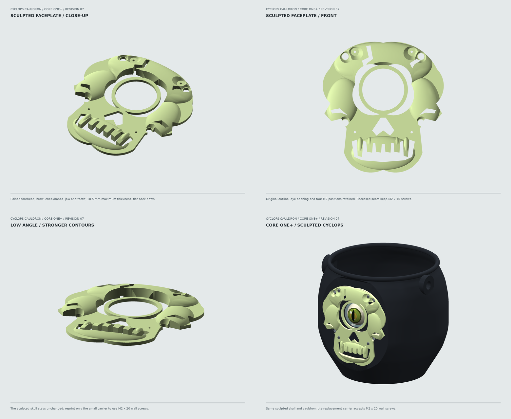

# Cyclops Cauldron For CORE One+

A single-nozzle black cauldron with a **separately printed sculpted skull**, attached
using four M2 screws. The HalloWing M0, glass lens, battery cradle, and removable
candy guard remain serviceable. Revision 7 changes only the small carrier to
use readily available **M2 x 20 mm bucket screws**. This is the only carrier
design supplied, in both the individual and combined print jobs.
The cauldron, sculpted skull, guard, test coupon and rope holes are unchanged.
**Physical fit and hanging tests are still required.**

## Print The Carrier And Guard Together

**Use [03_04_carrier_guard_BLACK_04HF_PLA.gcode](usb/COREONE_04HF_PLA/03_04_carrier_guard_BLACK_04HF_PLA.gcode)**
instead of separate jobs 03 and 04. It prints **one revision-7 M2 x 20 carrier
and one complete guard together on the same plate**, layer-by-layer, using
one spool of conventional PLA and the successful cauldron settings.
Estimate: **109.53 g / 5 h 17 m**; have about **130 g available** for margin.

Both parts keep their validated back-down orientations, with **15 mm between
them**. Settings: **0.20 mm layers, seven perimeters, 15% gyroid, no supports or
brim**, 220/215 C nozzle and 60 C bed, **0.4 mm high-flow nozzle**.
Do not also print the separate carrier/guard jobs unless you want extra copies.
The [combined 3MF](print/03_04_carrier_guard_black.3mf),
[audit](docs/carrier_guard_validation.json), and
[printing instructions](docs/PRINTING.md#combined-carrier-and-guard) are included.

## Print The Skull In Conventional White PLA

**Use [02_skull_WHITE_04HF_PLA.gcode](usb/COREONE_04HF_PLA/02_skull_WHITE_04HF_PLA.gcode)**
instead of the glow job. This is the same sculpted geometry, using the printer
and conventional-PLA settings from the successfully printed cauldron:
**0.4 mm high-flow nozzle, 220 C first layer / 215 C thereafter, 60 C bed**.
It retains **0.10 mm detail layers, 100% rectilinear infill, seven perimeters,
and no supports or brim**. Estimate: **64.17 g / 4 h 52 m**.

Copy this file to USB, load the same conventional PLA in white, clear the sheet,
and select the file containing **WHITE**, not GLOW. Use the same unchanged
printer/nozzle setup as the successful cauldron print; do not bypass warnings.
White PLA does not need an abrasive-filament nozzle check and will not glow.
Print only one skull: the white file is an alternative, not a sixth part.
The original glow file and all other jobs remain unchanged.
See the [white-PLA audit](docs/white_skull_validation.json) and
[printing guide](docs/PRINTING.md#white-pla-skull).

## Shorter-Screw Carrier

**Already printed the parts? Reprint only
[job 03, the M2 x 20 carrier](usb/COREONE_04HF_PLA/03_carrier_BLACK_04HF_PLA.gcode).**
Replace any old copy of job 03 on the USB drive. The four bucket nuts now sit
at the bottom of **15.9 mm deep rear-access wells**; the 13 mm post section
ahead of each nut gives a nominal **1.9 mm screw-tip allowance** with an M2 x 20
screw, 0.5 mm washer, 3 mm wall and 1.6 mm nut.

The PCB posts, 12 mm rear-component clearance, lens spacing, guard attachment
and +/-2 mm alignment travel do not change. Keep the four **M2.5 x 20** screws
for the PCB/lens module. You need **eight M2 x 20** total: four for the carrier
and four for the guard, plus the existing four **M2 x 10** skull screws.
See the [updated assembly steps](docs/ASSEMBLY.md#3-carrier-to-wall).

## Sculpted Faceplate

The forehead, brow, cheeks, jaw and teeth now have more pronounced contours,
reaching **10.5 mm maximum thickness**. The original flat back, hole pattern,
eye bezel and **3 mm screw seats** are unchanged. The existing four **M2 x 10**
screws, washers and nuts still fit. The skull itself is unchanged in revision 7.

**Still upgrading an old flat faceplate? Print
[job 02, the sculpted skull](usb/COREONE_04HF_PLA/02_skull_GLOW_04HF_PLA.gcode).**
It uses the same conditional **0.4 mm hardened high-flow / glow PLA** setup below,
with **0.10 mm layers**, approximately **98.72 g and 5 h 40 m**. The old flat
faceplate and the separate variant folder are retired; the standard faceplate
STL, STEP, 3MF and USB filename now all contain this sculpted version.



## USB Files: Check The Setup First

Five actual, audited G-code jobs plus the white-PLA alternative for job 02
and the combined alternative for jobs 03/04
are included. **They are not universal printer
files.** Hardware and filament details were unavailable, so these explicit
assumptions were used:

- Stock **Prusa CORE One+**, single tool, with firmware compatible with Prusa's
  current official COREONE profile. The files carry the **6.8.1+16182** firmware notice.
- **0.4 mm high-flow nozzle**, wear-resistant/hardened for the glow print.
- **1.75 mm PLA and glow PLA**, both rated for **220 C first layer, 215 C thereafter**.
- **Clean smooth PEI sheet, 60 C bed**; official chamber control is retained.

**Do not run these files with a 0.6 mm or standard-flow nozzle, PETG, an MMU/INDX
profile, or incompatible filament.** Prusament PETG Ultraglow is PETG, not PLA.
Do not bypass printer/nozzle warnings. When the setup matches, follow the
[USB checklist](usb/COREONE_04HF_PLA/START_HERE.txt) and
[printing instructions](docs/PRINTING.md).

| USB Job | Filament | Estimate | Time |
| --- | --- | ---: | ---: |
| [01 Mounting test](usb/COREONE_04HF_PLA/01_test_BLACK_04HF_PLA.gcode) | Black PLA | 37.27 g | 1 h 47 m |
| [02 Sculpted skull](usb/COREONE_04HF_PLA/02_skull_GLOW_04HF_PLA.gcode) | Glow PLA | 98.72 g | 5 h 40 m |
| [02 White skull alternative](usb/COREONE_04HF_PLA/02_skull_WHITE_04HF_PLA.gcode) | Conventional white PLA | 64.17 g | 4 h 52 m |
| [03 HalloWing carrier](usb/COREONE_04HF_PLA/03_carrier_BLACK_04HF_PLA.gcode) | Black PLA | 26.20 g | 1 h 32 m |
| [04 Battery guard](usb/COREONE_04HF_PLA/04_guard_BLACK_04HF_PLA.gcode) | Black PLA | 83.38 g | 3 h 44 m |
| [03+04 Carrier and guard together](usb/COREONE_04HF_PLA/03_04_carrier_guard_BLACK_04HF_PLA.gcode) | Conventional PLA | 109.53 g | 5 h 17 m |
| [05 Full cauldron](usb/COREONE_04HF_PLA/05_cauldron_BLACK_04HF_PLA.gcode) | Black PLA | 622.99 g | 26 h 22 m |

For a new build, print jobs **01-04 and perform the fit test before job 05**. Reuse the skull,
carrier, and guard in the full cauldron. Change filament between jobs through
the printer menu; there are no mid-print color changes and no purge tower.


## Design

- Printed body envelope: **224 x 209 x 200 mm**, with a rounded belly, narrowed
  neck, **8 mm rolled lip**, and a stable 146 mm flat base. No printed handle.
- **3 mm nominal walls, 3.6 mm floor**, and 10 mm thick rope anchors.
- Two **13 mm rope holes**, intended for approximately 8-10 mm nylon sail rope.
- Both holes stay **16.66 mm forward of the geometric center**, toward the eye,
  exactly as on the already-printed cauldron. They are not rebalanced for the new skull.
- A **128 x 138 mm glow skull**, up to **10.5 mm thick**, printed flat-back-down.
  **Four M2 x 10 screws, washers, and nuts** seat on unchanged 3 mm lands inside
  recessed pockets. The black wall is not recessed.
- **44.4 mm through-hole** for the stock 40 mm glass lens. The acrylic kit,
  not the printed bezel, retains the glass.
- Removable carrier, 12 mm PCB rear-component clearance, and +/-2 mm vertical
  eye alignment. Four **M2 x 20 screws attach the carrier to the bucket** using
  deep, rear-access sliding nut wells.
- A removable candy guard with a **33 x 42 x 8.5 mm battery bay**, strap slots,
  wire space, ventilation slots, and top USB access.

**Hardware correction:** Adafruit's #4013 lens kit uses **M2.5**, not M2.
This design keeps its 6 mm M2.5 lens standoffs and uses separate M2 bucket
fasteners. Four longer M2.5 screws are needed behind the PCB. Do not screw M2
fasteners into the kit's M2.5 threads. See the [hardware list](docs/ASSEMBLY.md).

## Editable Print Files

| File | Contents |
| --- | --- |
| [Mounting test 3MF](print/01_mount_test_black.3mf) | Black 116 x 28 x 103 mm wall section |
| [Skull faceplate 3MF](print/02_skull_faceplate_glow.3mf) | Sculpted glow skull, flat back down, reused after the test |
| [Carrier 3MF](print/03_carrier_black.3mf) | Revision 7, M2 x 20 mounting; black, back-down with posts up |
| [Battery guard 3MF](print/04_guard_black.3mf) | Black, back-down with walls pointing up |
| [Cauldron 3MF](print/05_cauldron_black.3mf) | Black, upright on its base |
| [Assembled STEP](cad/assembled_bucket.step) | Editable solids in assembly coordinates, without electronics |
| [Parametric source](design/bucket.py) | Cauldron profile, skull, mass balance, mounting details, and test section |
| [Relief source](design/sculpted_faceplate.py) | Forehead, brow, cheeks, jaw and teeth; fixed mounting clearances |

Each 3MF contains **one material, on extruder 1**, correctly positioned on a
250 x 220 mm bed. STL and STEP parts are included too. These geometry files can
be resliced for a different nozzle or material with the matching official
printer preset. The sculpted faceplate STL is independently printable; do not
combine black and glow as a multipart co-print. Old dual-head plates are retired.

Assembly details and the screw list are in the
[fit-test guide](docs/ASSEMBLY.md#fit-test-first).
The new [illustrated assembly sequence](docs/ASSEMBLY.md#illustrated-assembly-sequence)
has six numbered cards covering the skull, lens/PCB, carrier, battery, guard,
and final rope checks. Open the [assembly overview](renders/assembly/overview.png)
or individual full-resolution cards in the guide. Hardware and rope are
illustrative; the printed geometry comes from the validated STL meshes.

## Filament Budget

All figures include one full bucket, one test section, one carrier, and one guard.

| Material | Solid CAD upper estimate | Printing allowance | Budget | Offline sliced estimate |
| --- | ---: | ---: | ---: | ---: |
| Black | 780.86 g | 125 g | **905.86 g** | **769.84 g** |
| Glow | 98.41 g | 50 g | **148.41 g** | **98.72 g** |

Assumed maximum densities: **1.30 g/cm3 black, 2.00 g/cm3 glow**. The offline
slice includes supports, brims, and the official single-nozzle startup purge.
Estimates are not measurements of a physical print. Extra copies, failed prints,
and manual filament-loading purges are not included. Both supplied job totals
are below **1,000 g per spool**, with substantial remaining margin.

## Balanced Rope Mounts

The left/right hole centers remain **X = +/-99.33, Y = -16.66, Z = 178 mm**.
The stronger faceplate adds about 32 g at the nominal glow density and shifts the
assembled center of mass slightly toward the eye. The existing rope axis is
kept fixed, with the updated center of mass about 77 mm below it.
The nominal model includes the printed body, skull, carrier, guard, PCB,
battery, glass, acrylic kit, screws, washers, strap, and pad. It excludes the
test coupon, removed supports, and a symmetric rope handle.
These balance estimates use glow PLA. The lighter conventional white skull
changes the balance; repeat the hanging check with your actual assembly.

| Centered candy load | Predicted fore-aft tilt |
| --- | ---: |
| Empty, electronics installed | 2.1 degrees toward the eye |
| 500 g | 2.7 degrees away from the eye |
| 1,000 g | 4.5 degrees away from the eye |

Leaving the holes on the geometric centerline would produce about **14.1 degrees**
of empty tilt in this model. Actual hardware masses, infill, and uneven candy
change the result; this is not a guarantee of perfect balance at every load.
See the [balance diagram](renders/10_rope_balance.png) and
[hanging-test instructions](docs/ASSEMBLY.md#rope-balance).

## Print Bed Previews

These show **five separate jobs**, each in its actual 3MF position and print
orientation on a dimensioned **250 x 220 mm CORE One+ bed reference**. All views
use the same camera scale. Amber lines are brim/support extrusion paths from
the matching USB G-code; they print in the job's filament, not a second colour.
No electronics, screws, or assembled-part transforms are added to these views.
The bed is a dimensional reference, not a detailed model of the printer chassis.

| Job | Print Bed Render |
| --- | --- |
| 01 Black mounting test | [View](renders/print_beds/01_mount_test_black.png) |
| 02 Sculpted glow skull, flat back down | [View](renders/print_beds/02_skull_faceplate_glow.png) |
| 03 Black HalloWing carrier, posts up | [View](renders/print_beds/03_carrier_black.png) |
| 04 Black battery guard, open side up | [View](renders/print_beds/04_guard_black.png) |
| 05 Black cauldron, upright | [View](renders/print_beds/05_cauldron_black.png) |


## Review The Design

[Design overview](renders/overview.png) includes front, rear, top, cutaway,
test mounting, a glow study, the empty printed eye opening, rope balance, and
three sculpted-faceplate close-ups. The focused
[faceplate overview](renders/faceplate_overview.png) shows the stronger contours.
An additional [exploded assembly view](renders/07_exploded_mount.png) is included.
All printed parts are rendered from the exported STL meshes. The eye animation,
electronic components, and glass optics are illustrative reference geometry;
they are not printable parts or a prediction of optical focus/glow brightness.


## Rebuild

Python 3.11 was used on ARM Linux. CadQuery creates the solids; VTK/PyVista
renders offscreen. No OpenSCAD or Blender installation is needed.

```sh
uv venv .venv --python 3.11
uv pip install --python .venv/bin/python -r requirements.txt
.venv/bin/python tools/build.py
.venv/bin/python tools/render.py
.venv/bin/python tools/render_assembly.py
.venv/bin/python tools/check_slicer.py --slicer /path/to/prusa-slicer-2.9.6
.venv/bin/python tools/check_slicer.py --white-skull --slicer /path/to/prusa-slicer-2.9.6
.venv/bin/python tools/check_slicer.py --carrier-guard --slicer /path/to/prusa-slicer-2.9.6
.venv/bin/python tools/render.py --print-beds
```

The build regenerates the replacement carrier and assembled STEP, but verifies
and reuses the cauldron, skull, guard and coupon exports. The `check_slicer.py`
command requires **PrusaSlicer 2.9.6** and regenerates only carrier job 03;
the other four existing jobs are re-audited and kept byte-for-byte unchanged.
The optional `--white-skull` command generates only the distinct white-PLA
job and [white profile](profiles/core_one_plus_0.4HF_white_PLA.ini), preserving
all five original jobs. Its separate audit records the source plate, cauldron
profile and output hashes, layer settings, bounds and rejected unsafe mutations.
The optional `--carrier-guard` command creates the combined 03/04 plate and
G-code without changing any individual job. Its audit checks source meshes,
object spacing, both native tool assignments, and actual extrusion on both
objects through every shared layer; sequential-object printing is disabled.
Object names, not PrusaSlicer's variable object-ID order, identify the parts.
The base CAD manifest covers only the five individual meshes and plates;
the combined plate has its own validation manifest. Run the sequence-audit
regression tests with `.venv/bin/python -m unittest discover -s tests`.
The sixteen unchanged CAD, mesh, plate and G-code files are protected by
[printed-part hashes](docs/printed_parts.json).
On this ARM Linux/WSL machine it uses the official portable Windows build via
interop; `--slicer` accepts a native 2.9.6 executable on another platform.
The first run downloads the pinned profile bundle if it is not cached.
Profile sources and assumptions are recorded in [profiles/provenance.json](profiles/provenance.json).
The build checks
solid validity, closed/wound meshes, material and assembly collisions, matching
coupon geometry, fastener clearances, bed bounds, and filament budgets.
The carrier check verifies M2 x 20 nut engagement, rear nut-loading access,
bearing lands and clearance across the full vertical adjustment.
It also checks support-critical body slopes, material centroids, and the
fixed printed rope axis against the actual reinforced mounting bores. The saved
cauldron, carrier and guard STEP files are also tested for faceplate collisions.
The G-code audit checks executable startup and shutdown commands, single-nozzle
use, temperature limits, flow limits, and all model-phase moves. It is not a
physical print test or confirmation of the user's unspecified machine setup.
The `--print-beds` render command checks the 3MF and G-code hashes against that
audit before drawing the five job previews. It does not regenerate or modify
the print files. Use `--print-beds --jobs 2 5` to refresh selected views only.
The assembly renderer checks the assembly dimensions, PCB mounting pattern, and
all five source STL hashes against the CAD validation report. It produces six
annotated cards and their overview, and records source/image hashes in
[its manifest](renders/assembly/manifest.json). It does not modify CAD, print
plates, or G-code.

Results: [CAD/mesh validation](docs/validation.json),
[native slicer validation](docs/slicer_validation.json), and
[mechanical sources and assumptions](docs/SOURCES.md).