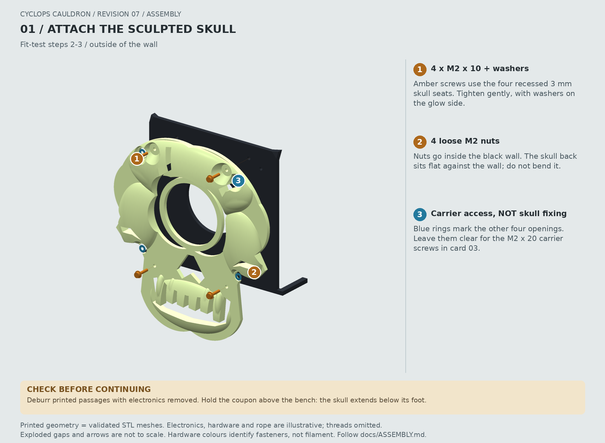
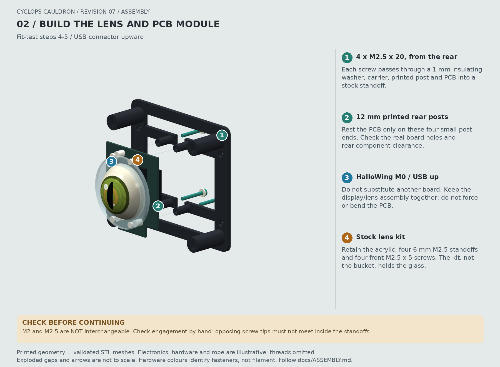
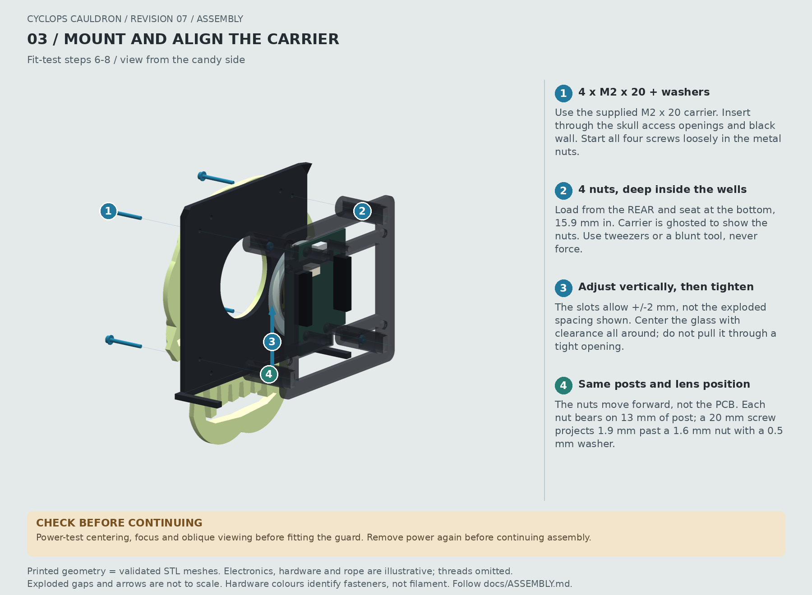
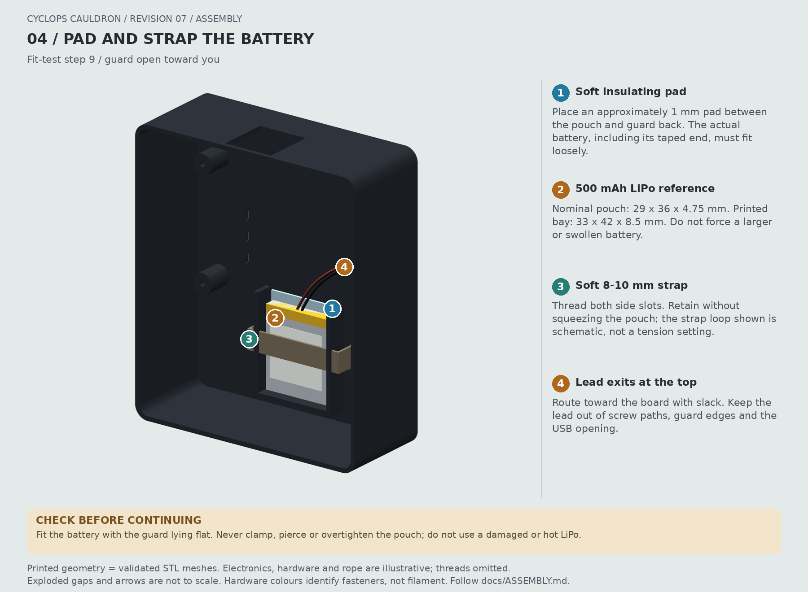
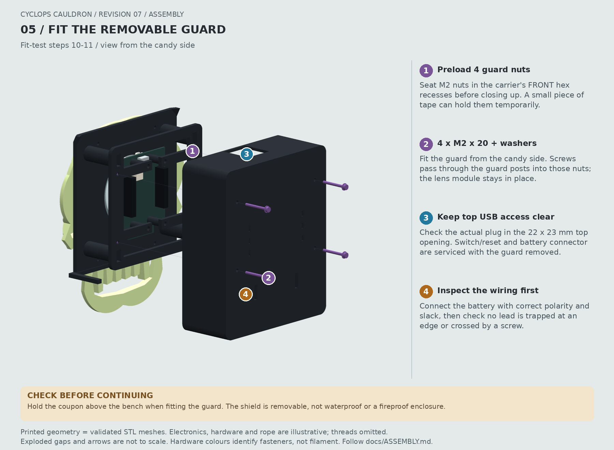
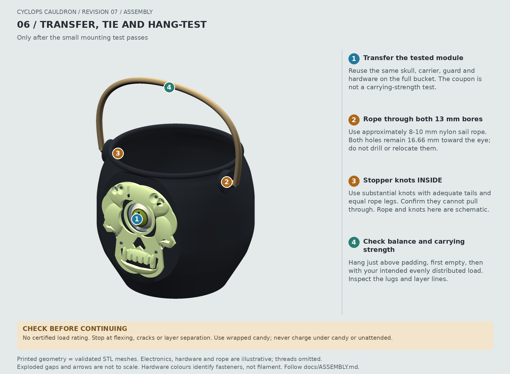

# Cyclops Cauldron Assembly

**Build the small test section before the full bucket.** CAD dimensions and
native slicing have been checked; real parts, printer tolerances, and carrying
strength have not. Use only the HalloWing **M0**, not a different board model.

**Conventional white PLA skull:** the geometry and four M2 x 10 screws are
identical to the glow version; follow the same assembly steps. Use the
[WHITE job](../usb/COREONE_04HF_PLA/02_skull_WHITE_04HF_PLA.gcode) instead of GLOW.
The illustrations show glow material, and the balance figures below assume it;
repeat the hanging test for the lighter white skull.

**The only supplied carrier uses M2 x 20 mm bucket screws.** Print the
[small carrier, job 03](../print/03_carrier_black.3mf), or use the combined
carrier/guard job for the same carrier geometry. Its four bucket nuts sit
deeper inside rear-access wells so **M2 x 20** screws reach them. Reuse the
cauldron, sculpted skull, guard and test coupon; no drilling or modification of
those parts is needed. The PCB supports, lens position, guard mounts and
vertical adjustment are unchanged. Use the specified screw lengths and seat
the metal nuts fully; do not force screws into printed plastic.

Transfer the PCB/lens module with its existing **four M2.5 x 20 screws and
insulating washers**. Keep the stock acrylic, front screws and lens standoffs
assembled, then check alignment again. The skull still uses four M2 x 10 screws.

## Illustrated Assembly Sequence

These six cards follow the [fit-test sequence](#fit-test-first) below. Open an
image for its full-resolution numbered callouts. Printed parts come from the
validated STL meshes; electronics, fasteners, battery, strap and rope are
illustrative reference geometry. **Exploded gaps and arrows are not to scale.**
Hardware colours distinguish fastener groups, not extra filament colours.
The rope path and knot markers are schematic, not knot-tying instructions.

### 1. Skull To Test Wall

Use **four M2 x 10 screws**, glow-side washers, and loose nuts inside the wall.
Do not confuse their recessed seats with the four carrier access openings.

### 2. Lens, PCB And Carrier

Keep the stock lens kit together and the USB connector upward. The **four rear
M2.5 x 20 screws and 1 mm insulating washers** pass through the carrier, its
printed posts, and PCB into the stock 6 mm standoffs. Check the real screw-tip
engagement before tightening; M2 hardware does not fit the kit threads.

### 3. Carrier To Wall

Use **four M2 x 20 screws** from outside and four nuts seated at the bottom of
the carrier's **15.9 mm deep rear rectangular wells**. Load the nuts from behind;
do not leave them at the rear opening. Start loosely, center the eye within the
+/-2 mm vertical adjustment, and check glass clearance before tightening.
Power-test the display, then remove power before continuing assembly.

### 4. Battery Pad And Strap

Fit the battery in the guard while it lies flat. Use a soft insulating pad and
an **8-10 mm soft strap** through both slots. The pouch must remain loose,
without pressure from the strap, screws, or wiring.

### 5. Removable Guard

Preload the other four carrier nuts in the **front hex recesses** before
closing up. Connect the battery with correct polarity and slack, inspect the
wire routing, then use **four M2 x 20 screws and washers** from the candy side.
Check USB plug access and guard removal without disturbing the lens.

### 6. Transfer And Hanging Checks

After the coupon passes, reuse the tested parts on the full cauldron. Install
rope through the existing bores with substantial inside stopper knots and
adequate tails. Follow the [rope-balance](#rope-balance) and
[final-use checks](#final-assembly-and-use); there is no certified load rating.

## Hardware List

| Quantity | Item | Purpose |
| ---: | --- | --- |
| 1 | Adafruit #3900 HalloWing M0 | Eye display and controller |
| 1 | Adafruit #3853, 40 mm glass lens | Convex eye |
| 1 | Adafruit #4013 acrylic lens-holder kit | Keep acrylic, four 6 mm M2.5 F-F standoffs, and four front M2.5 x 5 screws |
| 1 | Adafruit #1578, 3.7 V 500 mAh LiPo | 29 x 36 x 4.75 mm nominal battery |
| 4 | **M2.5 x 20 mm** machine screws | Replace the kit's four short rear screws; pass through carrier, printed posts, and PCB into the stock standoffs |
| 4 | **1.0 mm thick M2.5 insulating washers**, outside diameter <=6 mm | Under the long rear screw heads, against the carrier |
| 4 | **M2 x 20 mm** machine screws | Bucket/coupon to the revision-7 carrier |
| 4 | **M2 x 20 mm** machine screws | Candy guard to carrier |
| 4 | **M2 x 10 mm** machine screws | Separate glow skull to the black wall |
| 12 | M2 hex nuts, approximately 4 mm across flats and 1.6 mm thick | Eight in carrier recesses; four loose inside the wall for the faceplate |
| 12 | M2 washers, approximately 0.5 mm thick, outside diameter <=5.5 mm | Spread head loads on the bucket, guard, and skull |
| 1 | Soft hook-and-loop strap, 8-10 mm wide and <=2 mm thick, about 120 mm long | Loosely retain battery through guard slots |
| 1 | Thin, soft, electrically insulating pad, approximately 1 mm thick | Cushion battery against the guard's back panel |
| As needed | Nylon sail rope, approximately 8-10 mm diameter | Handle; two stopper knots inside the pail |

Total loose screw requirements are **eight M2 x 20**, **four M2 x 10**, and
**four M2.5 x 20**, plus the four stock front M2.5 x 5 screws in the lens kit.
The shorter M2 screws in an assortment are not needed for this assembly.

Black-finished screw heads can make the four visible M2 fasteners less noticeable.
Prefer nonconductive hardware around the PCB. If using metal screws, inspect
their clearances from components and exposed conductors. Do not use pointed
self-tapping screws, drill the PCB, or substitute M2 for an M2.5 thread.

## Mounting Datums

Units are millimeters. Viewed from outside: X is right, Z is up, and the cauldron's
flat mounting face is Y = -89. The eye center is X = 0, Z = 125. USB points upward.

| Feature | X coordinates | Z relative to eye center |
| --- | --- | --- |
| PCB/lens-kit upper mounting holes | -8.89, +8.89 | +24.476 |
| PCB/lens-kit lower mounting holes | -8.89, +8.89 | -21.244 |
| Bucket-to-carrier M2 fasteners | -40, +40 | -35, +35 |
| Guard-to-carrier M2 fasteners | -41, +41 | -25, +25 |
| Skull-to-wall M2 fasteners | -30, +30 | -45, +40 |

The stock kit uses the **17.78 x 45.72 mm** four-hole pattern, not the larger
lanyard holes. The lens is approximately **1.616 mm below the mounting-pattern
midpoint** in the published drawing. Do not center the lens by simply averaging
the upper and lower hole rows. The carrier's M2 slots permit +/-2 mm of vertical
adjustment to accommodate the actual lens/PCB revision.

## Side Stack

From outside to inside, excluding screw heads:

1. Sculpted skull: back Y = -89, 3 mm seating layer and screw seats at Y = -92,
   raised contours reaching approximately Y = -99.5. The eye bezel remains
   at Y = -92; black wall spans Y = -89 to -86.
2. Stock lens/acrylic assembly. Nominal acrylic front Y = -82.5, back Y = -79.7.
3. Stock **6 mm M2.5 F-F standoffs**, between acrylic and the PCB front.
4. PCB front Y = -73.7, rear Y = -72.1; nominal thickness 1.6 mm.
5. **12 mm printed rear posts**, touching the PCB only around its mounting holes.
6. **3 mm carrier plate**, front Y = -60.1, rear Y = -57.1.
7. 1 mm insulating washers and M2.5 x 20 rear screw heads.
8. Free space, then guard inner back Y = -45.5, outer back Y = -43.5.

The separate **bucket-to-carrier** screw stack is now: 0.5 mm washer + 3 mm
black wall + 13 mm printed post before the nut + 1.6 mm nut = **18.1 mm**.
An M2 x 20 screw leaves approximately **1.9 mm of tip beyond the nut**, inside
the post's open well. The nut's front bearing plane is Y = **-73.0**, 15.9 mm
forward of the carrier rear. The skull's larger carrier-access holes let the
screw heads bear on the black wall, so skull thickness is not in this stack.
These are nominal dimensions; confirm real washer/nut sizes and engagement
before installing electronics. The guard's separate M2 x 20 stack is unchanged.

With a 2.8 mm acrylic plate, rear M2.5 screws engage about **2.4 mm** and the
stock front screws about **2.2 mm** into each 6 mm standoff. Their tips must not
meet. Actual acrylic/washer/screw dimensions can vary: check by hand, and add
appropriate insulating washers or use a different screw length if needed.
Never tighten a screw that bottoms out as a way to pull the assembly together.

The 40 mm lens has a 16 mm overall height; its exact lip seating depth was not
measured. The hole clears the full 40 mm diameter rather than assuming a precise
glass surface profile. The stock holder retains the lip. **The bucket does not
press-fit, clamp, or support the glass.** Expect the dome to protrude a few mm
past the printed bezel, depending on the actual kit stack.

## Fit Test First

1. Print [the black test section](../print/01_mount_test_black.3mf),
   [the complete glow skull](../print/02_skull_faceplate_glow.3mf),
   [the black carrier](../print/03_carrier_black.3mf), and
   [the black guard](../print/04_guard_black.3mf). Each is a separate one-filament
   job. Follow the CORE One+ USB prerequisites in [PRINTING.md](PRINTING.md).
2. Remove supports from the eye opening, mounting holes, nut recesses, and all
   PCB support faces. Deburr printed holes gently. M2 should pass freely through
   the 2.4 mm passages and M2.5 through the 2.9 mm passages. Enlarge only printed
   plastic if necessary, with all electronics and the battery removed.
3. Attach the skull to the empty test wall with **four M2 x 10 screws**, washers
   on the glow side, and loose nuts inside the wall. These four 2.4 mm holes
   are at X = +/-30, Z = 80 and 165. The four larger openings in the skull are
   access holes for the separate carrier screws, not the faceplate attachment.
   The sculpted face has recessed, flared screw pockets with unchanged 3 mm
   seating thickness and 8.4 mm diameter flat lands. Tighten gently so its
   flat back sits against the wall without bending it.
   Do not overtighten brittle glow filament. With a 0.5 mm washer, the 10 mm
   screw passes through 3 mm skull + 3 mm wall and leaves about 3.5 mm for the
   nut and tip; check real hardware lengths before installing electronics.
4. Confirm all four carrier post centers match the real PCB without bending it.
   Check that rear components do not touch the carrier. Stop if the board revision
   differs; update the source dimensions instead of forcing the hardware.
5. Assemble the lens and acrylic with the four stock 6 mm spacers and front
   M2.5 x 5 screws. Place the PCB on the carrier posts. From the rear, install
   the four **M2.5 x 20 screws and 1 mm insulating washers**, through the carrier,
   posts, and PCB into the kit spacers. Tighten only enough to locate the PCB.
6. Load four M2 nuts through the carrier's rear rectangular openings and seat
   them at the **bottom of the 15.9 mm deep wells**, not at the rear surface.
   Keep the nuts' flats against the 4.3 mm wide side walls; the 8.8 mm height
   allows the vertical adjustment. With the wall-facing posts down, gravity,
   tweezers or a narrow blunt tool can help seat them. It is easier to trial-fit
   the nuts and screws before fitting the electronics in step 5. Deburr only
   printed plastic, with electronics removed; do not hammer nuts into place.
   Loosely connect the carrier to the test section using **four M2 x 20 screws
   and 0.5 mm washers** from outside. Verify all four engage the metal nuts and
   tighten without bottoming, bending the carrier or pulling the posts sideways.
7. Slide the carrier vertically until the eye is centered and the glass is clear
   of the printed opening all around. Verify the acrylic and its screw heads do
   not touch the wall. Do not use the screws to pull glass through a tight hole.
8. Power the board and inspect eye centering/focus, visibility at oblique angles,
   and any light leak. The kit fixes the optical spacing; changing carrier depth
   moves the complete lens/PCB assembly, not the lens relative to the TFT.
9. Check that your actual battery sits loosely in the **33 W x 42 H x 8.5 D mm**
   pocket, including its folded/taped end and the insulating pad. Pass the strap
   through the two 2.6 x 11 mm slots and retain it without squeezing the pouch.
10. Preload four M2 nuts into the hex recesses on the carrier's front side. A small
   piece of tape can hold them temporarily. Connect the battery with slack in the
   102 mm lead, then mount the guard from the candy side with **M2 x 20 screws and
   washers**. No wire may cross a screw path or be trapped under the guard edge.
11. Check USB plug access through the guard's 22 x 23 mm top opening, battery
    connector access with the guard removed, and removal of the guard without
    disturbing the lens. The power switch/reset are serviced with the guard off.

The coupon's foot supports the bare **wall + PCB + carrier** test. The full skull
and battery guard extend below the coupon foot; hold the test assembly above the
bench or over its edge when trial-fitting the guard. Test the battery bay
separately while the guard lies flat. The coupon is not a whole-bucket load test.

Record actual hole fit, glass clearance, acrylic thickness, vertical adjustment,
and battery clearance before committing to the full print. Reuse the tested
full skull, carrier, guard, and hardware in the full bucket. No second glow
faceplate or electronics set needs to be printed.

## Rope Balance

The two 13 mm bores have centers at **(-99.33, -16.66, 178)** and
**(+99.33, -16.66, 178)**. Both are shifted **toward the electronics**, not placed
on the geometric Y = 0 diameter. These are the fixed coordinates of the
already-printed cauldron; neither the lugs nor the holes move when the faceplate
mass changes. The lug height is the same on both sides.

The [generated balance report](validation.json) uses CAD volume centroids for
the four installed printed parts, nominal densities of **1.24 g/cm3 black** and
**1.50 g/cm3 glow**, and estimated installed hardware positions. It includes
Adafruit's 17.5 g PCB and 10.5 g battery masses, plus estimates of **31 g glass,
5 g acrylic/lens hardware, 12 g carrier/guard fasteners, 3 g faceplate fasteners,
and 3 g strap/pad**.
The balance densities are nominal material estimates, distinct from the higher
1.30/2.00 densities used for the spool budget. The 12 g aggregate fastener
estimate is retained after shortening the four bucket screws; weigh the actual
hardware if a more precise balance prediction is needed.

Nominal empty assembled mass is **864.9 g**, with its center at approximately
**(0, -19.44, 100.59)**. This gives essentially equal left/right loads and puts
the center about **77.4 mm below** the rope axis. The stronger sculpted skull
adds about 32 g versus the old flat plate at the nominal density. Predicted
empty tilt is **2.1 degrees toward the eye**, versus 14.1 degrees with
uncompensated holes. A sensitivity check varying black/glow density and glass
mass gives approximately **-4.4 to -0.6 degrees**
of empty pitch; other uncertainties, including an asymmetric rope or packing,
are not bounded by that check.

The original rope placement targeted **empty with all electronics installed**.
The current model reports balance on those fixed holes; it does not relocate them. Centered
500 g and 1,000 g candy loads, with assumed center at (0, 0, 65), give about
**2.7 and 4.5 degrees away from the eye**. A fixed hole pair cannot stay perfectly
level for every possible fill. `BalanceParameters.design_payload_g` and
`payload_center_mm` in the [parametric model](../design/bucket.py) can be changed
to study loads, but do not alter the fixed cauldron geometry. Use measured glass,
kit, fastener and filament values in those calculations when available.

After assembly, use equal-length rope legs with comparable knots and tails.
Hang the empty cauldron just above a padded surface, check rim level from front
and side, then repeat with the intended candy load distributed evenly. Stop
if a lug flexes, cracks, or shows layer separation. Do not relocate or elongate
holes by drilling through the thin body wall. The mounting coupon checks the
electronics fit, not whole-cauldron balance or lifting strength.

## Final Assembly And Use

Use the same sequence on the full cauldron. Thread rope through the left/right
13 mm holes, deburr their edges, and secure substantial stopper knots inside.
Leave adequate tails and check that the knots cannot pull through. No handle
geometry is included.

The rim, wall thickness, and reinforced bosses are intended to make a sturdy
candy cauldron, but there is **no certified load rating**. After the empty
hanging check, start with a 1 kg static
load over a soft surface, inspect the bosses and layer lines, and increase only
after a controlled proof test for your intended contents. Do not swing a loaded
bucket or use the rope as a neck strap. A failed layer bond cannot be detected
by CAD or slicing checks.

Use wrapped candy or a removable food-safe liner. Printed glow filament and
layered FDM surfaces are not being represented as food-contact safe. The guard
is a candy shield, not a sealed, waterproof, impact-proof, or fireproof enclosure.
Keep the glass away from impacts; it can break if dropped.

Switch off and empty the bucket before servicing. Charge in an open,
nonflammable location under supervision, preferably with the electronics removed
and guard off, never under candy. Do not charge unattended or use a swollen,
damaged, crushed, or hot LiPo. Use the HalloWing's intended LiPo charger/JST
connection and verify polarity. Never overtighten the battery strap or place a
screw tip against the pouch. Avoid heat, hot cars, and rain.