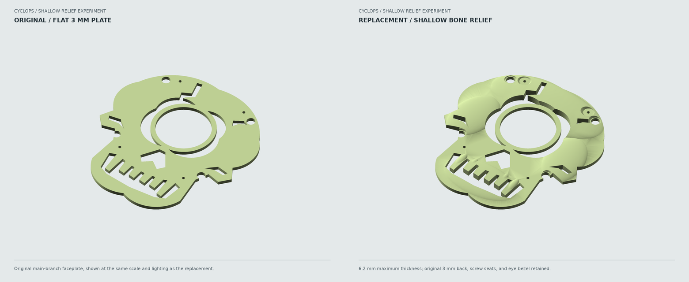
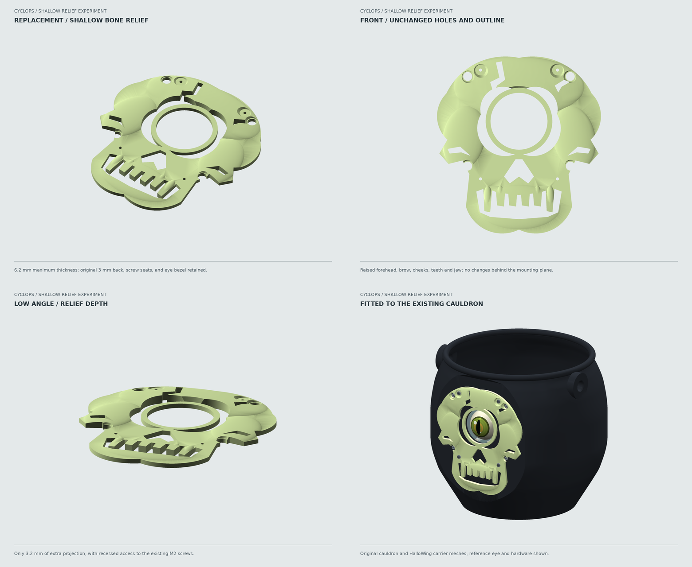

# Shallow Sculpted Skull

An optional replacement for the flat revision-4 faceplate. A gently raised
forehead, brow, cheekbones, jaw and teeth add depth without turning the plate
into a rounded skull head. **Only this faceplate needs printing.** The existing
cauldron, HalloWing carrier, guard, hardware locations and rope holes are unchanged.

Branch: `feature/sculpted-skull-faceplate`.
Compatibility baseline: commit `731c8d090d9382937c2cf054e11159906f80cf2b`.
The original manufacturing files remain intact for comparison or rejection of
this experiment. This is a digitally checked design, **not a physically tested fit**.



## What Changed

- Same approximately **128 x 138 mm** silhouette and flat back.
- Original **3.0 mm plate preserved in full**, including the existing holes.
- Maximum thickness **6.2 mm**, only **3.2 mm of additional outward projection**.
- Broad, rounded relief on the forehead and cheeks, with smaller raised teeth
  and jaw features. The dark eye/nose/mouth cutouts remain open.
- The eye bezel stays at the original depth. Relief is kept outside a **52.4 mm
  diameter** zone around the eye, with an outward-flaring transition.
- Screw seats remain **3.0 mm thick** within **8.4 mm diameter** pockets. The
  existing **M2 x 10 screws, washers and nuts** are reused; longer screws are
  not required. The four separate carrier-access openings remain clear.

The relief is added only above the original faceplate. Its horizontal footprint
does not extend outside the old plate, and each cap narrows above the original
3 mm layer. It prints flat, sculpture upward, without supports or a brim.

## Replacement Files

| File | Purpose |
| --- | --- |
| [CORE One+ G-code](skull_sculpted_COREONE_04HF_PLA.gcode) | Print just the replacement skull |
| [3MF](skull_sculpted.3mf) | Correctly positioned single-material geometry for reslicing |
| [STL](skull_sculpted.stl) | Flat-back-down manufacturing mesh |
| [STEP](skull_sculpted.step) | Editable solid in print orientation |
| [Parametric design](../../design/sculpted_faceplate.py) | Relief shapes and compatibility constraints |
| [Validation report](validation.json) | CAD/mesh, existing-part clearance, G-code and hash checks |

## Printing

Use the supplied G-code **only** for the same documented setup as the original
jobs: a stock single-tool **Prusa CORE One+**, **0.4 mm wear-resistant high-flow
nozzle**, **1.75 mm glow PLA** rated for **220 C first layer / 215 C thereafter**,
and a clean **smooth PEI sheet at 60 C**. It is **not** for a standard-flow or
0.6 mm nozzle, PETG, MMU, or INDX. Actual filament and nozzle details remain
unconfirmed; reslice with matching profiles if yours differ. Do not bypass
printer/nozzle warnings. The original firmware notice, cleaning, probing,
chamber control and shutdown commands are retained.

| Setting | Replacement Job |
| --- | --- |
| Layer height | 0.10 mm; 0.20 mm first layer |
| Orientation | Flat back on the bed; sculpted face up |
| Infill | 100% rectilinear |
| Supports / brim | None / none |
| Maximum flow | 3 mm3/s |
| Filament estimate | **71.78 g**, using the conservative 2.00 g/cm3 density |
| Time estimate | **4 h 4 m** |

The finer layers reduce visible steps on the shallow curves. At the budgeting
density this is about **15.9 g more** than the original flat skull's sliced
estimate, still well within the original 1 kg glow allowance.

To use the file, place the replacement `.gcode` on your USB drive, clear the
sheet, load suitable glow PLA through the printer menu and select the job.
Observe cleaning, probing and the first layer. Allow the sheet and part to cool
before removal. Do not install electronics or the battery during printing.
The existing [USB checklist](../../usb/COREONE_04HF_PLA/START_HERE.txt) still
applies to the machine/material setup, but **do not rerun the black jobs** for
this replacement. The old job 02 still prints the original flat plate.

## Installation

1. Power off the HalloWing and remove candy before working around the electronics.
   Remove the guard as needed for access to the four faceplate nuts.
2. Remove only the old faceplate's four M2 x 10 screws and washers. The carrier
   and M2.5 lens assembly do not need to move. Do not confuse the faceplate
   screws with the separate carrier screws.
3. Deburr the replacement plate's back and holes. Place its flat back against the
   same cauldron mounting face, with the existing 40 mm lens centered in the eye.
4. Reuse the same M2 x 10 screws, washers and nuts. The mounting centers are
   **X = +/-30 mm, Z = 80 and 165 mm** in the cauldron coordinates. Tighten only
   enough to seat the plate without bending it. Its recessed seats keep the
   screw grip length unchanged; check actual screw tips and nearby wiring.
5. Confirm that glass does not contact plastic, the eye animation is unobstructed,
   and the carrier screws remain accessible. The **44.4 mm through-bore** and
   original bezel are unchanged; the acrylic kit still retains the lens.
6. Refit the guard and check hanging balance just above a padded surface before use.

The original rear datum remains **Y = -89 mm**, and the eye center remains
**X = 0, Z = 125 mm**. No new material extends behind this mounting plane.
CAD intersections with the actual committed cauldron, carrier and guard STEP
solids are zero. The entire original 3 mm faceplate volume is retained, not
replaced with a new approximation of the mounting interface.

## Balance And Remaining Checks

The existing rope holes stay at **Y = -16.66 mm, Z = 178 mm**. The old automatic
rope-balance build path is deliberately not used for this replacement.
At the nominal 1.50 g/cm3 glow density the relief adds about **11.9 g**, giving
an estimated **0.8 degree forward pitch** with the existing empty assembly.
Actual filament density, hardware, rope knots and candy packing can change that.
No balance or carrying-load guarantee is implied; perform the physical hanging test.

The G-code was generated with PrusaSlicer 2.9.6 using the existing, unchanged
[glow profile](../../profiles/core_one_plus_0.4HF_glow_PLA.ini), with the overrides
above. All 61 layers, single-tool use, actual motion bounds, temperature/flow
limits, start/end checks and four deliberately invalid G-code cases were checked.
The independent build verifies all production files against the baseline commit;
it does not overwrite their CAD, 3MF, STL, G-code, reports or renders.

## Review Views

- [Same-camera before/after comparison](renders/comparison.png)
- [Sculpted close-up](renders/02_sculpted_oblique.png)
- [Front](renders/03_sculpted_front.png)
- [Low-angle depth view](renders/04_sculpted_raking.png)
- [On the existing cauldron](renders/05_assembled.png)
- [On the CORE One+ bed](renders/06_core_one_bed.png)



## Rebuild Only This Variant

From the repository root, using the existing environment and slicer:

```sh
.venv/bin/python tools/sculpted_faceplate.py --all
```

Or use `--build`, `--slice`, and `--render` separately. `--slicer` accepts another
PrusaSlicer 2.9.6 executable. Do not run the full bucket build to create this
replacement: it is intentionally a separate experiment. All output stays in
this variant folder; merging the branch adds the optional plate without changing
the original default five-job workflow.